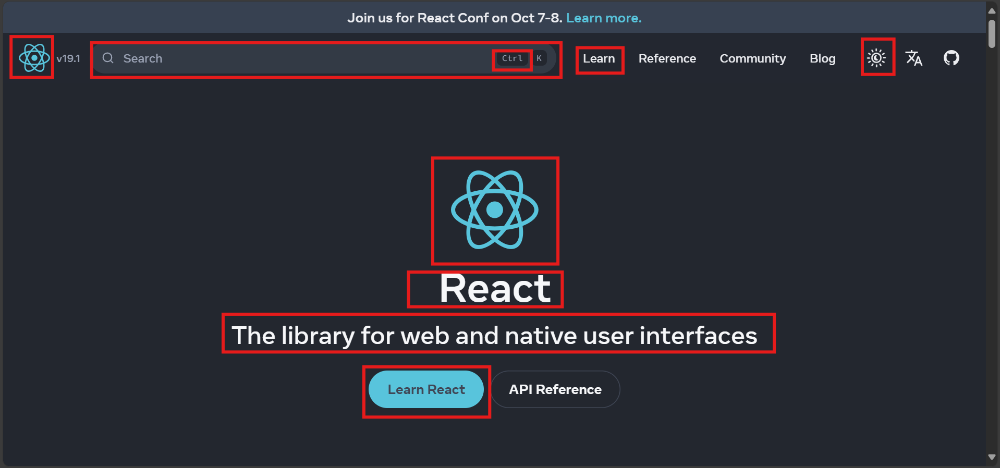
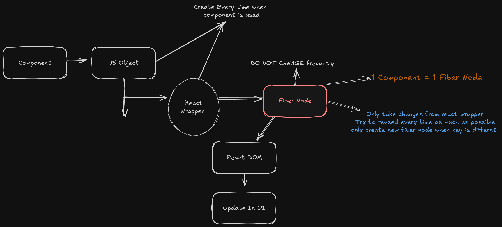
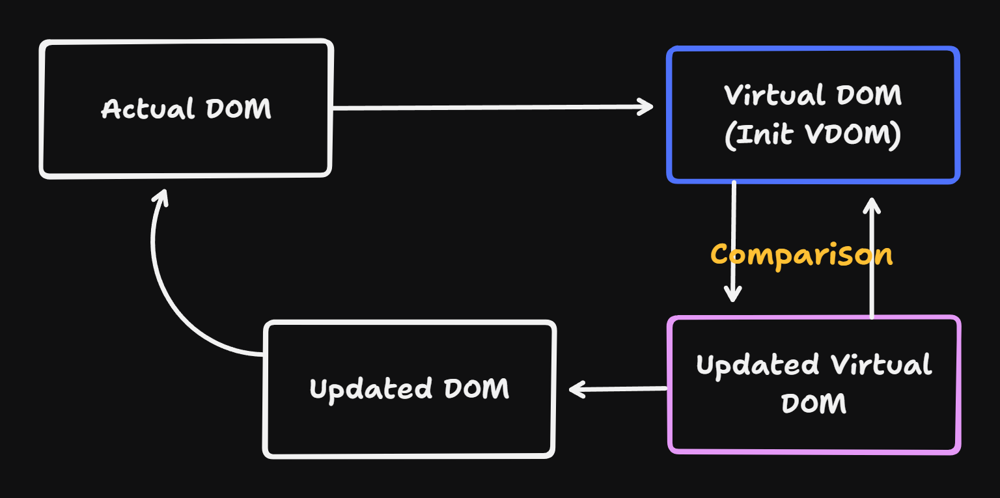

# Day 2

- [Day 2](#day-2)
  - [Journey To JSX](#journey-to-jsx)
  - [styling](#styling)
  - [Components](#components)
  - [Component size](#component-size)
  - [Component Usage](#component-usage)
  - [Props](#props)
  - [VDOM](#vdom)


## Journey To JSX
- Before react jQuery and knockoutjs were very popular for making  interactive dynamic website  
- jQuery provides several easy methods for DOM and AJAX interaction that are built top of the `JavaScript` , in simple world jQuery is a syntactic sugar on `JavaScript` 
- In knockoutjs we have to build `HTML` known as template inside we have to write the `JavaScript` variables and we have write logic `JavaScript` in separate file 
- But when our files getting bigger than tracking of variables is very hard
- Later on angular js which work on templating it solve some of the problem but same problems remain same 


- than react it tell developers to make components , developers able to write `JavaScript`  and `HTML` in single file , initially it used classes , for making easier react team introduce `JSX` (**JavaScript XML**) .
- `JSX` = UI + logic

```jsx
function MyApp() {
    return <h1>Hello World </h1>; // this is JSX not HTML
    // It looks like html but no it is JSX
}
```

- ***JSX prevent us from XSS attack***
- html and js
```html
<div id="root"></div>
<script>
    const root = document.querySelector("#root");
    root.innerHTML = ``
</script>
```

- JSX automatically escapes expressions, preventing potential XSS attacks.

```jsx
function MyApp() {
    const userInput = "alert('Hello World')";
    return <p> {userInput}</p>;
}
```
- display as text won't execute

## styling 
- inline CSS passed as an object
```jsx
function MyApp() {
  return (
    <input
      type="text"
      placeholder="Enter Your name"
      style={{
        backgroundColor: "pink",
        padding: "10px",
        margin: "10px",
        outline: "none",
        border: "none",
        borderRadius: "20px",
      }}
    />
  );
}

```

- OR
```jsx
function MyApp() {
  const styles = {
    backgroundColor: "pink",
    padding: "10px",
    margin: "10px",
    outline: "none",
    border: "none",
    borderRadius: "20px",
  };
  return <input type="text" placeholder="Enter Your name" style={styles} />;
}

```

- external CSS
```jsx
import "<PATH_TO_CSS>"
function MyComponent() {
  return <h1 className="myClass">Hello, React!</h1>;
}
```
- and many way but above to are very known 

- **Tailwind CSS (Utility-First CSS Framework)**
- Most preferred way 

```jsx
function MyComponent() {
  return <h1 className="text-blue-500 text-xl">Hello, Tailwind CSS!</h1>;
}

```


## Components
- In react we write function that return some UI 
- Components first letter must start with Uppercase, due to differentiate between react components and html element (html is case insensitive <P> </P> and <p> </p> will treated as same )
- If Component start with lower case than react treat as `HTML` Tag not Component that why we always start components name with upper case letter
- We should return only one element from component , if we want to return more then we should use parent tag or `<> </>` which are known as fragments 

**In any react project we have to think about all possible components.**



1. Header
   1. Logo ⭐
   2. text -> v19.1
   3. Text Field ⭐
      1. icon 
      2. button
         1. ctrl
         2. k
   4. Links
      1. Learn ⭐
      2. Reference
      3. Community
      4. Blog
   5. three more button
      1. Dark / light toggle ⭐
      2. translate
      3. GitHub
2. Main
   1. React logo (1. Header 1. logo reused but different height)
   2. React text ⭐
   3. The library for web and native user interfaces (same as above reused)
   4. Button ⭐
      1. Learn React
      2. API reference
   

- with only some components (only ⭐) we can built homepage of react website just giving some props 


## Component size

- It dependence on developer or guideline
- Atomic
  - Materiel UI -> broke components into smallest possible part 
- Non - Atomic
  - Airbnb

- Generally we use combination of Atomic and Non - Atomic

## Component Usage
```jsx
function MyApp(props = { num: 10 }) {
  return <div> {props.num}</div>;
}
MyApp() // -> it is just function call return plain JavaScript Object ,, nothing related to React 
<MyApp> // -> React Component
```
- `<MyApp>` is living instantiate OR Component Object

- component to the UI


## Props
- in simple function we give some argument to the function 
- in react world it is known as `props`(properties)
- props are used for passing data from parent component to child component
- 2 reasons to use props:
- 1. Reusability : it is allow us to reuse the code by changing behaviour using props 
- 2. Dynamic data : it allows us to pass dynamic data to our components

Notes :-
-  Parent to child
-  Read only - child component can not directly modify props
-  Props make components reusable

```jsx
function MyApp() {
  // Parent Components
  function someValue(val) {
    console.log("Values . ", val);
  }
  return <Search doSomething={someValue} />; // someValue -> Props
}

function Search(abc) {
  // someValue  recived here -> but here i called as abc
  // child component
  function handleInput(e) {
    // e -> event
    abc.doSomething(e.target.value);
  }
  return (
    <input type="text" placeholder="write something" onInput={handleInput} />
  );
}

```

```ascii
<MyApp>
   └── <Search doSomething={someValue} />
           └── <input> (User types something)
                   ├── handleInput() calls doSomething()
                   ├── doSomething() logs value in console

```


## VDOM
- In react application react create Virtual DOM which is based on Original Dom -> Virtual DOM kind of object that store the all element in page
- It continuedly checking different between Original DOM and Virtual DOM known as Diffing algorithm 
- Only difference part it update to original DOM , it prevent unnecessary update and performance optimization
- React Create Two Virtual DOM during the rendering process
1. Initial Virtual DOM
   1. Lightweight copy of actual DOM
2. Updated Virtual DOM
   1. When Component Updates than React create another Virtual DOM with updated state.
   2. And react compare the new Virtual DOM With previous one using Reconciliation .
   3. after comparison Updated Virtual DOM Became new Virtual DOM 



<!-- 
### Working of V-DOM
  1. When state changes, React creates a new Virtual DOM tree.
  2. The new Virtual DOM is compared with the previous Virtual DOM (Diffing process).
 1. React calculates the differences between the two trees.
  2. It updates only the nodes of the actual DOM that have changed to reflect the new state, rather than redrawing the entire DOM.
### Why V-DOM ?
- Performance optimization

```ascii
Original DOM            Virtual DOM (Memory) 
   |                                  |
   |                                  |  
   V                                  V
+------------+        +------------+        
|            |        |            |        
|  <div>     |        |  <div>     |        
|     A      |        |     B      |  (Updated)  
|  </div>    |        |  </div>    |  
|            |        |            |  
+------------+        +------------+ 

Once the difference is detected, React updates the Actual DOM accordingly.

```

**Efficiency**: Instead of re-rendering the entire page, React efficiently updates only the parts of the DOM that have changed. This minimizes browser repaints and reflows, leading to better performance and more responsive applications.
**Flexibility**: The Virtual DOM allows for easier manipulation, testing, and implementation of complex UIs. Developers can work with JavaScript objects instead of directly with the browser's DOM, which can be less flexible and slower.
**Abstraction**: It abstracts away the complexities of the DOM, allowing developers to focus on building their applications without worrying about the browser's intricacies.

### How V-DOM works
1. **Initial Render**:
   - The React component is rendered for the first time.
   - React creates a Virtual DOM tree that mirrors the actual DOM.

2. **State Update**:
   - When state or props change, React creates a new Virtual DOM tree based on the updated state.

3. **Diffing Algorithm**:
   - React performs a diffing process between the new Virtual DOM and the previous Virtual DOM.
   - This process identifies the differences between the two trees (e.g., added/removed elements, changed attributes, updated text content).

4. **Reconciliation**:
   - React generates a list of the minimal changes (delta) needed to update the actual DOM to match the new Virtual DOM.

5. **Batched Updates**:
   - React batches multiple updates into a single batch to reduce the number of reflows and repaints, further optimizing performance.

6. **Updating Actual DOM**:
   - React applies the minimal set of changes to the actual DOM, ensuring that only the necessary parts are updated.

### Performance Benefits

- **Efficient Re-renders**: By only updating the parts of the DOM that have changed, V-DOM minimizes the performance overhead associated with re-rendering.
- **Reduced DOM Manipulations**: Directly manipulating -->