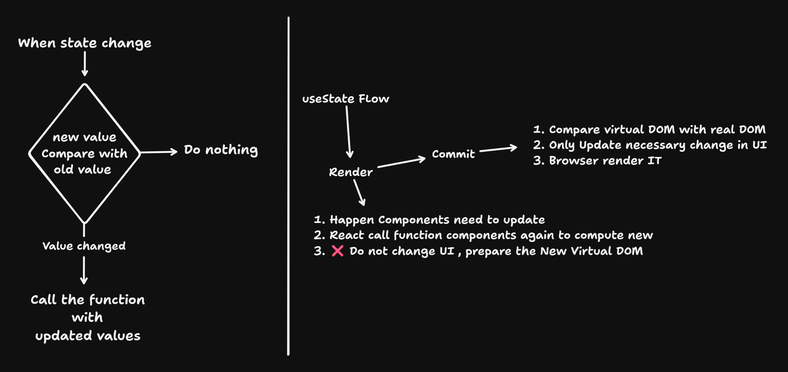

# Day 4

- [Day 4](#day-4)
  - [useState with pure JavaScript](#usestate-with-pure-javascript)
  - [React](#react)
    - [Code 1](#code-1)
    - [Code 2](#code-2)
    - [useRef](#useref)
    - [code 3](#code-3)
    - [useState](#usestate)
  - [takes](#takes)

## useState with pure JavaScript
- here when every time click on add it update the UI .
- Even though value of input box is same .
- If browser Some how optimize that by checking previous value , than no need of react .
- Browser were written in `C++` , By `JavaScript` we are just given instruction to the `C++` , If we want to optimize than we have to change in `C++` which is my be slow
```js
<!DOCTYPE html>
<html lang="en">
  <head>
    <meta charset="UTF-8" />
    <meta name="viewport" content="width=device-width, initial-scale=1.0" />
    <title>Sum of Two Numbers</title>
  </head>
  <body>
    <div>
      <input
        type="number"
        placeholder="Enter Number 1"
        name="first Numebr"
        id="num1"
      />+
      <input
        type="number"
        placeholder="Enter Number 2"
        name="Second Numebr"
        id="num2"
      />
      <button id="btn" onclick="add()" type="button">Add</button>
      <br />
      <span>Result <span id="res"></span></span>
    </div>
    <script>
      function useState(value) {
        let val = value;
        function setValue(newValue) {
          document.getElementById("res").innerText = newValue;
        }
        return [value, setValue];
      }
      const [value, setValue] = useState(0);
      function add() {
        const num1 = document.getElementById("num1").value;
        const num2 = document.getElementById("num2").value;
        const ans = Number(num1) + Number(num2);
        const res = `${num1} + ${num2} = ${ans}`;
        setValue(res);
      }
    </script>
  </body>
</html>

```
- React will check the state before updating the DOM 

## React

### Code 1

- here in react  still use `JavaScript` instead of React Powers

```jsx
const Sum = () => {
  const add = () => {
    const num1 = document.getElementById("num1").value;
    const num2 = document.getElementById("num2").value;
    document.getElementById("res").innerText = Number(num1) + Number(num2);
  };
  return (
    <div>
      <input type="number" name="num1" id="num1" placeholder="Enter Number 1" />
      +
      <input type="number" name="num2" id="num2" placeholder="Enter Number 2" />
      <br />
      <br />
      <button type="button" onClick={add}>
        Add
      </button>
      <br />
      <span id="res"></span>
    </div>
  );
};

const App = () => {
  return (
    <>
      <Sum />
    </>
  );
};
```


### Code 2

[Hooks Page](../hooks.md)

### useRef
- via `useRef` hook 
> `useRef` is a react way to access DOM element
- More precipice definition 
> `useRef` is a React hook that provides a way to persist a mutable reference to a DOM element or a value across renders without causing re-renders.

> It’s commonly used to directly access a DOM element or to store a value that doesn’t need to trigger a re-render when updated.

- here still Same Direct DOM update issue 
- why we are direct updating the DOM and react does not know any DOM update , we have to tell react about Updating via `useState` hook 
```jsx
import { useRef } from "react";

const Sum = () => {
  const num1 = useRef();
  const num2 = useRef();
  const add = () => {
    const n1 = num1.current.value;
    const n2 = num2.current.value;

    document.getElementById("res").innerText = Number(n1) + Number(n2);
  };
  return (
    <div>
      <input
        type="number"
        name="num1"
        id="num1"
        ref={num1}
        placeholder="Enter Number 1"
      />
      +
      <input
        type="number"
        name="num2"
        id="num2"
        ref={num2}
        placeholder="Enter Number 2"
      />
      <br />
      <br />
      <button type="button" onClick={add}>
        Add
      </button>
      <br />
      <span id="res"></span>
    </div>
  );
};

const App = () => {
  return (
    <>
      <Sum />
    </>
  );
};
```


### code 3

### useState

- Here I am trying to perform addition of two number based on `JavaScript` variable
```jsx
const App = () => {
  const num1 = 100;
  const num2 = 100;
  let res = 0;
  const add = () => {
    res = num1 + num2;
    console.log(res);
  };
  return (
    <>
      <h1>
        {num1} + {num2} = {res}
      </h1>
      <button onClick={add}>Add two values</button>
    </>
  );
};
```
- output `200` only show on console not in DOM React no information about this variable 

```jsx
const App = () => {
  const [value, setValue] = useState(0);
  const num1 = 100;
  const num2 = 100;
  let res = 0;
  const add = () => {
    res = num1 + num2;
    setValue(res);
    console.log(res);
  };
  return (
    <>
      <h1>
        {num1} + {num2} = {value}
      </h1>
      <button onClick={add} type="button">
        Add two values
      </button>
    </>
  );
};
```
- `const [state, setStateFunction] = useState(initialState)` .
- `useState(initialState)` hook return two thing value and function that update a value .
- Now react will track the value of the variable updations 
- why `useState` -> return array 
  - If it return a object than we can not you our own name / variable ,it force to use fixed name , if we want to change than it increase unnecessary syntax complexity

## takes
- react always (automatic) re-render a components when every state or props change , data change ensure UT stays in sync state .
- re-render it is not a problem it it just a function call 
- it became problem when we loop on thousand element and just optimize it
- re-render means call the function with updated values
- re-render = function call -> state change -> by useState function
- here `setValue({ count: 0 })` is a new reference but values not getting changed so no UI updates 
```jsx
const App = () => {
  console.log("render");
  const [value, setValue] = useState({ count: 0 });
  const add = () => {
    setValue({ count: 0 });
  };
  return (
    <>
      <button onClick={add}>Click me</button>
      {value.count}
    </>
  );
};
```


- if their are multiple changes in state than react will combine into the batch and update UI only once after completing the execution of the function
- React internally optimizes state updates by batching them together. This means that if you have multiple state updates within a short period (e.g., within the same event loop iteration), React may combine them into a single update.
- This batching behaviour helps to reduce the number of re-renders and improve performance, as React only needs to update the UI once for the entire batch of state changes.
